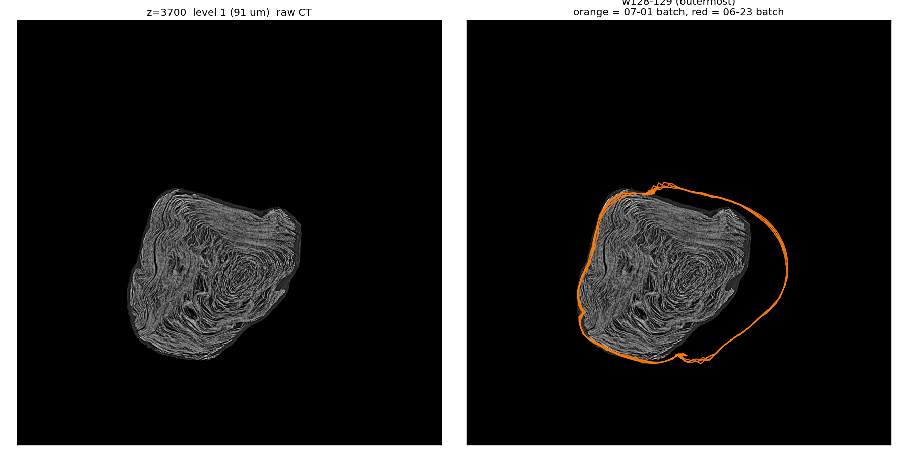
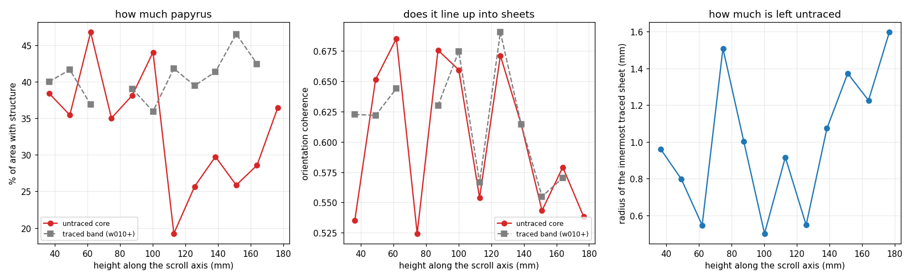
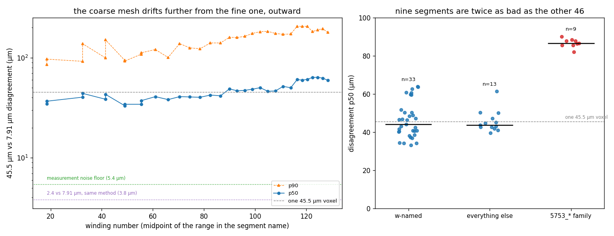
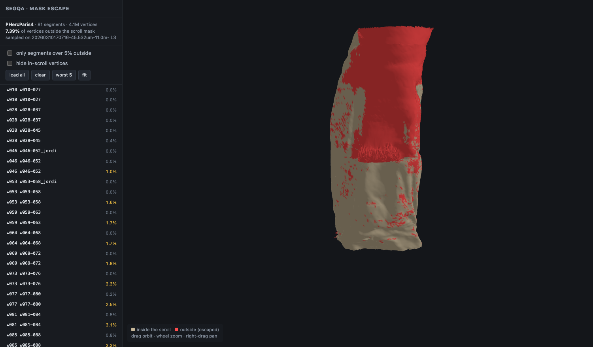
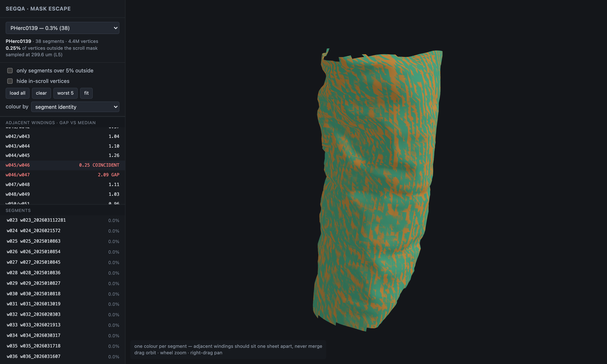
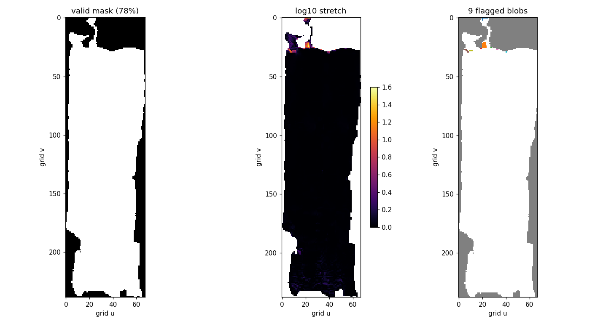

# segqa — 赫庫蘭尼姆卷軸分割的免標註品質檢查

針對已發布的 `tifxyz` 表面 mesh 做自動品質檢查。所有資料直接以一般 HTTP 從
Vesuvius Challenge 的 open-data bucket 讀取——免認證、不需批次下載、本機不留
整卷資料。

> [English version](README.md) ｜ 投獎說明：[SUBMISSION.zh-TW.md](SUBMISSION.zh-TW.md)

## 核心想法

分割品質檢查有個先有雞還是先有蛋的問題：要驗證一個品質指標，你需要一批已經標好
「好」或「壞」的 segment，而那種標註並不存在。於是任何指標都無法被證偽。

有一個例外。官方發布的體積是**去背過的**——卷軸實體以外的 voxel 精確等於 `0`。
所以

> *這個頂點到底有沒有落在物體上？*

對每一個已發布 mesh 的每一個頂點，都能在沒有標註的情況下客觀回答。一個跑到卷軸
外面的 mesh 就是錯的，這件事不需要任何人同意。

這就是本工具量的東西。

## 它找到了什麼

掃描 Scroll 1（`PHercParis4`，81 個 segment、410 萬個頂點）：

| 圈數 | 落在卷軸外的頂點 |
|---|---|
| w010–w100 | 0.00 – 7 % |
| w101–w115 | 10 – 14 % |
| w120–w129 | 16 – **39 %** |

隨圈數單調上升，而且內圈是**精確的 0.00 %**——這個指標在它該安靜的地方是安靜
的。最外圈那個 segment（`w128-129`）在卷軸上半部大半離開了物體：z≈3700 以上有
76 % 的頂點落在空無一物的地方。



左：原始 CT。右：追蹤出來的面。左側與頂部貼著卷軸邊緣是正確的；右半那道弧線穿過
純粹的虛空。

同一批資料還給出兩個結果：

- **一個真實的覆蓋缺口。** 在 z≈300（底部約 18 mm）紙莎草完整且層次清晰，但只有
  8 條追蹤線通過，而中段有 86 條。**不是毀損——是沒有人追蹤過。**
  見 `sections-z300-2000-3850.png`。
- **版本回歸。** 每個圈數範圍都被分割過兩次（2026-06-23 與 2026-07-01）。重跑
  改善了外圈（w128-129：−8.9 個百分點），卻讓內圈退步（w046–w094 最多 +2.6 個
  百分點，而且原本是精確的 0.00 %）——它拿內圈的精度換了外圈的覆蓋。

## 語料庫掃描

299 個 segment、11 個卷軸、1.47 億個頂點：

| 卷軸 | segment 數 | 頂點 | 離群 | 超過 5 % |
|---|---|---|---|---|
| PHerc0800 | 6 | 33 K | **0.00 %** | 0 |
| PHerc0814 | 19 | 1.4 M | 0.05 % | 0 |
| PHerc0172 | 53 | 28.6 M | 0.14 % | 0 |
| PHerc0139 | 38 | 4.4 M | 0.25 % | 0 |
| PHerc0343P | 8 | 112 K | 3.26 % | 1 |
| PHerc0009B | 18 | 1.2 M | 5.39 % | 10 |
| PHerc0500P2 | 38 | 531 K | 5.45 % | 7 |
| PHercParis4 | 81 | 4.1 M | 7.39 % | 27 |
| PHerc0841 | 3 | 136 K | 11.82 % | 1 |
| PHerc1667 | 20 | 106 M | 19.04 % | 17 |
| PHerc1447 | 15 | 255 K | 33.40 % | 10 |

分布明顯兩極：四個卷軸實質上是零（0.00–0.25 %），兩個嚴重偏離。**有四個卷軸
能拿到 0.00 %，這正是這個指標量到真實現象而非邊界雜訊的論據。**

**解析度偏差是量出來的，不是假設的。** 金字塔只到 level 5，所以各卷軸的有效取樣
解析度不同——PHerc1667 是 76.8 µm，多數其他卷軸是 276–300 µm。與其假設這無關
緊要，`sensitivity.py` 在 8 倍的體素尺寸範圍內重跑同一批 segment：

| segment | 91 µm | 182 µm | 364 µm | 728 µm |
|---|---|---|---|---|
| w069-072 | 0.50 % | 0.04 % | 0.01 % | 0.01 % |
| 20230702185753 | 3.04 % | 1.41 % | 1.31 % | 1.38 % |
| w085-088 | 3.74 % | 3.31 % | 3.30 % | 3.38 % |
| w120-121 | 20.11 % | 18.86 % | 18.36 % | 17.75 % |
| w128-129 | 38.72 % | 32.33 % | 30.00 % | 29.28 % |

整個範圍內平均值從 11.17 % 移動到 8.64 %：**體素尺寸差 8 倍，指標只差 1.29
倍**，方向也符合預期——降取樣的 mask 被模糊放寬，因此更寬容。每一個層級的排序
都沒有變。

語料庫掃描的解析度跨度是 4 倍，比這裡測試的還窄，所以跨卷軸的偏差遠低於 1.29
倍。相對於卷軸之間 0.00 % 到 33 % 的差距，它不改變任何結論。絕對數值視為
±30 %，排序則是可靠的。

## 跳層：第二個獨立的檢查

mask 檢查看不到 tracer 滑到隔壁那張紙——那個面仍然在卷軸裡。網格失真也看不到，
因為跳層時參數空間保持局部等距。**這個訊號不存在於單一 segment 的內部。**

它存在於 segment **之間**。名字帶有官方圈數，相差一圈的兩個 segment 在重疊處
應該處處相距一個紙莎草厚度。這個期望值跟 mask 一樣是免費的：

- 間距塌到 ~0 → 兩者描到同一張紙，其中一個跳層了
- 間距約為兩倍 → 有一圈被跳過
- **是誰移位的，看它的另一個鄰居就知道**

`sheetswitch.py` 跑遍 92 組現成的相鄰圈數配對：

| 卷軸 | 配對數 | 旗標 | 比值範圍 |
|---|---|---|---|
| PHerc0172 | 43 | 0 | 0.64 – 1.46 |
| PHerc0139 | 35 | **2** | 0.25 – 2.09 |
| PHerc1667 | 14 | 0 | 0.85 – 1.21 |

PHerc0139 的 w46 跳到了 w45 的紙上：

```
w44/45   1.28   正常
w45/46   0.25   <-- 重合
w46/47   2.09   <-- 距離加倍
w47/48   1.11   正常
```

前後自洽，而且指得出責任歸屬：假如移位的是 w45，w44/45 也會讀到加倍，但它沒有。

**兩個檢查互相獨立，而這正是重點。** PHerc1667 在 mask 離群上是最差的卷軸
（19 %），在這裡卻完全乾淨、比值範圍還是三者中最緊的——它的問題是外緣飄離
物體，不是搞混紙張。PHerc0139 在 mask 上屬於最乾淨的一群（0.25 %），卻是唯一
帶著跳層的。**一個卷軸可以在某個檢查下看起來完美，而真缺陷只有另一個看得到。**

量到的間距在三個卷軸上分別是 147 / 151 / 164 µm——各自獨立計算、來自體素尺寸
相差 4 倍的體積、而且沒有在任何地方餵進物理常數。

有兩組因重疊不足被跳過（有列出，不是靜默丟棄）。

### Scroll 1 的展開

Scroll 1 的 segment 以圈數**範圍**命名（`w010-027`），原本沒有相鄰配對。
`unroll.py` 從繞軸心的角度反推每頂點的圈數，並以名字裡的範圍校準——**而那個
校準本身就是驗證：58 個 segment 量到的圈數全部落在精確的整數上**（4.0、3.0、
2.0⋯），軸心擬合有偏差不可能產生這種結果。過程中也確認命名是閉區間：
`w116-117` 是兩圈不是一圈。

有了圈數之後，`scroll1_switch.py` 跑同一套比對：**兩個批次合計 230 組相鄰
配對，零旗標**，比值 0.68–1.32。

這解決了一個關於 Scroll 1 標題的問題——標題位於最內側的圈。三項幾何檢查在那裡
全部通過：核心**確實有被追蹤**、那些 segment 的離群率是 0.00–1.74 %（21 個裡
13 個是精確的 0.00 %）、w010–w031 的圈數拓撲健全。**那些面在幾何上是健康的，
所以「那裡偵測不到墨」不能用分割做壞了來解釋。**

### 直接問核心本身

上面每一項量的都是 mesh。核心沒有 mesh——最內側被追蹤的是 w010，依高度不同距軸心
0.5–1.6 mm——所以剩下能問的只有影像本身：那裡面到底有沒有 tracer 可以跟的東西？
`core_structure.py` 用 HTTP Range 向 2.4 µm 體積要每個切面約 2 MB，在十二個高度
（沿軸 36–177 mm）上量，並拿同一張切面上 w010 外側那一圈已追蹤帶當對照：

- **coverage**——梯度能量超過全域門檻的面積比例：那裡到底有多少東西有結構
- **coherence**——96 µm 視窗內單位化雙角梯度向量的平均模長：那些結構有沒有排成紙層

| | 核心（w010 以內） | 已追蹤帶（w010 往外） |
|---|---|---|
| coherence，配對差的中位數 | −0.006（範圍 −0.087 … +0.046，n = 10） | — |
| coverage，掃描範圍下半 | 40.6 % | 38.7 % |
| coverage，掃描範圍上半 | **25.8 %** | 42.3 % |

w010 以內的紙層排列得跟被追蹤的那些一樣好——換三個門檻（40／60／80 百分位）
coherence 的差都停在零（−0.006／−0.006／−0.007）。下半部連紙的量也一樣多。上半部
少三分之一——而官方 FAQ 說 slice 編號大的那端是卷軸頂部（三份 `transform.json` 的
z→z 係數都是正的，所以 2026 的體積保持同一方向），這就是 Title Prize 頁面那句
*「頂部行已實體缺損」*的量化版本。



通過軸心的縱剖面 `core-longitudinal.png` 說明了核心在橫切面上為什麼長那樣：它的
紙層在 2 mm 高度上是連續的，只是強烈傾斜、穿過擬合出的軸心，而核心的一側是空的。
斜切一張傾斜的紙看起來就像碎片；先前把那些橫切面讀成「破碎的莎草紙」是錯的，撤回。

對找不到的標題——慣例上就在核心，2025 年 PHerc. 172 的書名正是在那裡找到的——這代表：
在掃描範圍的下半部，核心的紙跟已追蹤的部分一樣多、排列一樣整齊，影像裡沒有任何東西
解釋為什麼追蹤在 w010 停下。上半部則是真的比較空。

限制：二維切面；分帶平均依賴擬合出的軸心（coherence 本身不依賴）；只有一條縱剖面。

## 跨解析度一致性：第三個檢查

Scroll 1 現在有四個解析度的體積，而多數 segment 在不只一個體積上被 mesh 過。每個
細解析度體積都附一份 `transform.json`，把自己的 voxel 映到 2023 年那個 7.91 µm
體積上——所以共同座標系也是公開的。這給出第三個免費的期望，精神與前兩個相同：

> *同一個 segment 在兩個不同體積上 mesh 出來的兩張面，必須描述同一張紙。*

不需要標註，也不需要對「好的 mesh 長什麼樣」有任何意見——只是同一個實體曲面的兩份
獨立描述，它們必須吻合。

`xres.py` 量的是點到**曲面**的距離：先找最近頂點，再量到「該頂點 3×3 網格鄰域擬合
出的平面」的距離。點到**頂點**的距離在這裡不管用，`xres.py` 的控制組說明了原因——
網格點距約 158 µm，所以拿「保證落在曲面上的點」去查詢，中位數就已經是 79 µm。改成
點到曲面之後這個下限降到 5.4 µm，那才是量測自身的雜訊。

`xres_scan.py` 跑遍同時存在於 45.5 µm 與 7.91 µm 兩個體積上的 55 個 Scroll 1
segment，`xres_control.py` 是對照組：

| 配對 | segment 數 | 分歧 p50 | ＝較粗那個體積的幾個 voxel |
|---|---|---|---|
| 45.5 µm vs 7.91 µm | 55 | **46.6 µm** | 1.02 |
| 2.4 µm vs 7.91 µm | 9 | 3.7 µm | 0.47 |
| 1.129 µm vs 2.4 µm | 1 | 0.34 µm | 0.14 |

第一列之所以讀得懂，靠的是對照組。在兩個細解析度體積之間，同樣的比較、同樣的
transform、同樣的程式碼得到 3.7 µm 與 0.34 µm——緊了十二倍與一百倍。所以那 46.6 µm
不是量測造成的，也不是 transform 檔案格式造成的。一張莎草紙只有幾個 45.5 µm voxel
厚，而在那個解析度上描出來的面，結果就是不確定到大約一個 voxel。

這個數字裡面有兩個結構：

**5753 家族比其他所有人差一倍，而且完全不重疊。**

| 群組 | segment 數 | p50 範圍 | 中位數（45.5 µm voxel） |
|---|---|---|---|
| `w` 命名 | 33 | 33 – 64 µm | 0.97 |
| 其他（11 個 2023 年的＋2 個重做） | 13 | 39 – 61 µm | 0.96 |
| `5753_*` 家族 | 9 | **82 – 90 µm** | **1.90** |

九個 segment，每一個都比其餘 46 個全部更差。這正是這個檢查存在的理由：它指出一個
特定批次，而沒有人需要標註任何一個頂點。

**分歧由內往外單調上升。** 在 `w` 命名的 segment 上，p50 與圈數的相關係數 0.86：

| 圈數 | p50 | p90 |
|---|---|---|
| w010–w045 | 34 – 44 µm | 86 – 151 µm |
| w046–w088 | 33 – 42 µm | 93 – 141 µm |
| w089–w115 | 46 – 52 µm | 160 – 184 µm |
| w116–w129 | 60 – 64 µm | 180 – 207 µm |



左：每個 `w` 命名的 segment，粗細解析度之間的分歧對圈數作圖，兩條點線是對照組
給出的下限。右：同樣的 p50 依群組分開——`5753_*` 家族與其他所有人完全分離。

其中三個圈數範圍被分割過兩次（2026-06-23 與 2026-07-01），兩批在那裡的差距是
2.3、3.7、4.6 µm，所以這個水準是可重現的，不是單一次執行的假影。

對照組取樣涵蓋三個群組，不只是在 45.5 µm 上表現最好的那一群。兩個 `5753_*` segment
回來是 2.9 與 3.3 µm——**比 2023 那批還緊**；而在 45.5 µm 上圈數趨勢裡最差的
`w128-129`，回來是 3.8 µm，與最內圈相同。所以第一列裡的兩個結構都住在 45.5 µm 那
一側：那個批次與外圈都不是本質上難定位，只是**在 45.5 µm 上**難定位。（w128-129
在這裡確實仍有較長的尾巴——p90 29 µm，其他是 11–14。）

這個向外的趨勢也與 mask 檢查一致（同一份資料上同樣向外上升），而這個一致**不是**循環論證：一個
檢查問「這個頂點在不在物體上」，另一個問「兩個體積有沒有把同一張紙放在同一個位置」。

**這件事沒有被釐清。** 45.5 µm 那一側有兩個無法用現有資料分離的候選原因：粗體積
本身的解析度極限，以及**它自己的**對位品質——45.5 µm 的 `transform.json` 重現自己
的 landmark 的誤差是 45 個參考系 voxel（約 356 µm），而 2.4 µm 那份是 1.5 個
（約 12 µm）。純粹的對位誤差會表現成局部平移，而它沒有：在 4 mm 的區塊內，有號距離
的均值約 28 µm，而區塊內的散布約 77 µm（取 11 個密到足以填滿三個區塊的 segment 的
中位數），所以分歧的主體是形狀不同，不是位移。這不利於「全都是對位造成的」這個說法，
但也不能完全排除它。

**這裡不報「超過半個紙層的比例」**，儘管那個數字會很好讀。這份資料裡每一個紙層間距
的數值本身都是「在格點間距約 900 µm 的網格上量的最近點距離」，帶著一個大小不明的
離散化下限；拿它當分母，等於把那份不確定性洗成一個看起來很乾淨的百分比。粗體積的
voxel 才是真的已知的分母。

## Viewer



用 Three.js 畫出追蹤到的面，離群區域標紅，所以失敗的**形狀**看得見，而不只是
一個百分比。上圖裡整個卷軸上半部都是紅的——那正是表格裡「z≈3700 以上有 76 %
的頂點」的同一個缺陷。

```bash
python3 export_flags.py scan_plan.json            # 全部卷軸 -> viewer/data/
cd viewer && python3 -m http.server 8731
```

涵蓋全部 11 個卷軸、299 個 segment，用下拉選單切換。mesh 直接從 S3 串流（該
bucket 開放 CORS）；只有每頂點的旗標檔在本機提供，且降取樣到每個 segment 最多
128×128——所以整包是 2.2 MB，而不是 2.4 µm 的 mesh 原本需要的 106 MB。執行期
狀態掛在 `window.__segqa` 上。

側欄也列出相鄰圈數配對與它們的間距比值。點一個，它就只載入那兩圈，並依 segment
上色：



PHerc0139 的 w045（綠）與 w046（橘）應該相距一個紙莎草厚度。它們在整片表面上
互相穿插——把 0.25 這個比值變成看得見的東西。

## 使用方式

只需要 `numpy` 與 `matplotlib`。

```bash
python3 survey.py                      # 哪些卷軸同時有 segment 與 masked 體積
python3 plan_scan.py PHercParis4 ...   # 為每個卷軸挑體積與金字塔層級
python3 scan.py scan_plan.json         # 掃描 -> scan_results.json
python3 report.py scan_results.json    # 彙整表格與圖
```

下載的 mesh 與體積 chunk 快取在 `~/.cache/segqa`（可用 `SEGQA_CACHE` 覆蓋）。
**那是快取不是原始資料**——刪掉只損失重新下載的時間，沒有別的。

任意高度與解析度的橫截面，並把追蹤到的面疊上去：

```bash
python3 section.py ~/.cache/segqa/PHercParis4 1 300 2000 3850 sections.png
```

跨解析度一致性需要每個 segment 的第二份 mesh，以及公開的 transform：

```bash
python3 xres_fetch.py 7.91um      # transform ＋ 全部 7.91 µm mesh（約 180 MB）
python3 xres_fetch.py 2.4um       # 對照組的另一邊（約 2 GB；抓幾個就夠，
python3 xres_fetch.py 1.129um     #   不想等就直接中斷）
python3 xres.py 20230702185753    # 單一 segment 的三個解析度，附量測控制組
python3 xres_scan.py              # 全部 -> xres_results.json
python3 xres_control.py           # 對照組：兩個細解析度體積互相比較
python3 xres_plot.py              # -> xres-agreement.png
python3 core_structure.py         # 直接問核心本身 -> core-structure.png
```

## 關於資料的筆記

這些是花了時間才發現的事，希望能替你省下一些：

- **`tifxyz` 幾乎不用解析——直到它不是這樣。** Scroll 1 公開的 254 個 mesh 裡，
  240 個是傳統 TIFF、未壓縮、單一 strip：兩行程式碼。另外 14 個是 BigTIFF ＋ tile
  ＋ LZW ＋ 浮點預測器，而其中 8 個被切成 2–12 個 tile——那表示 tile offset 住在
  一個陣列裡，entry 的值欄位只是指向它的指標。單 tile 的讀取器會以
  `buffer is smaller than requested size` 失敗，沒指名任何原因。解析度不是判準：
  81 個 2.4 µm mesh 裡有 78 個是單純的單 strip，而 55 個較粗的 7.91 µm 裡有 11 個
  是 tiled（以每個 mesh 的 `x.tif` 為樣本，用 HTTP Range 讀——每個 mesh 兩個請求，
  不用下載）。`l0.py` 全都處理，而且仍然沒有 TIFF 相依。
- **mesh 是註冊在特定體積上的。** 目錄名字寫著是哪一個：
  `<seg>-on-<volume-id>-<解析度>um.tifxyz`。拿同一卷軸的另一個體積去取樣，會
  **靜默**得到垃圾。
- **體積是未壓縮的。** 一個 chunk 就是 C-order 的 `128³` 位元組，所以裡面的單一
  z 平面是連續的 16 KB 區塊：一個 Range 請求就能取得全解析度橫截面，1.3 MB 而
  不是 162 MB。
- **chunk 不存在就代表空的。** zarr 對缺席的 chunk 填 `fill_value`，這裡是 `0`，
  也就是卷軸外。所以 404 是答案，不是錯誤。
- **卷軸是彎的。** 軸心沿高度漂移約 400 voxel，所以單一的全域圓心會讓核心附近的
  半徑失去意義。要逐 z 分層擬合（`axis.py`）。
- **圈數就在 segment 名字裡**（`w010-027`、`-w062`），而且**由內往外**：w001 是
  最內圈。已驗證——Scroll 1 全部 28 個圈數群組的中位半徑嚴格單調上升。

## 行不通的作法

`l0.py` 量 `tifxyz` 四邊形網格的失真——邊長異向性與拉伸。**它偵測不到跳層**，
而且原因是結構性的、不是調參問題：tracer 走到隔壁那張紙時，參數空間保持局部
等距——格子仍然維持約 20 voxel 的間距、仍然方正。**失真在原理上就對這個缺陷
盲目。**

在真實資料上它只會沿著破洞的鋸齒邊界發作，而那是 valid mask 本來就免費給你的：



每個已發布 segment 的內部都均勻乾淨（p95 拉伸 1.05–1.11）。保留在這裡作為反例，
好讓下一個人不必花一天重新發現。

`wrapgap.py` 是第二條死路，同樣保留。沿著 grid 的一列走完整一圈，量落點的距離，
那應該等於一個紙層間距。**用 3D 距離量是錯的**：grid 的列在 z 方向是斜的，外圈
尤其嚴重，落點在高度上差了 2194 µm 而徑向只有 471 µm——所以 3D 數字量到的是
傾斜。只取徑向分量後中位數落在還算合理的 212 µm，但單一 segment 內部的分布太寬，
無法定位任何東西。已被 `unroll.py` 取代。

## 限制

- **跳層是在整圈尺度上偵測的。** 只影響一小塊的局部跳層會被中位數稀釋掉，會漏掉。
- **檢查二需要 segment 之間有重疊**；總共 8 組因重疊不足被跳過，那些有列出來，
  不是靜默丟棄。
- **「在 mask 外」不一定等於「tracer 弄錯了」。** 另一種解讀是 mask 把已經剝離、
  散開的外層排除掉了，而那些其實是真的紙莎草。兩者都值得知道，但只有前者是
  bug，本工具無法區分它們。畫出來的橫截面可以：在 Scroll 1 那個案例裡追蹤線穿過
  肉眼可見的空白，那裡是定案了，但無法一般化。
- **需要 masked 體積**，因此排除了 5 個確實有 segment 的卷軸。
- **絕對數值帶有約 ±30 % 的解析度不確定性**；排序則是可靠的。

## 狀態

能跑，但沒有打磨。自我檢查在 `l0.py`、`scan.py` 與 `export_flags.py` 裡——
`python3 l0.py` 完全不需要資料就能跑它自己的——但除此之外沒有測試套件。
